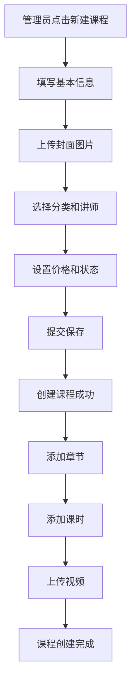
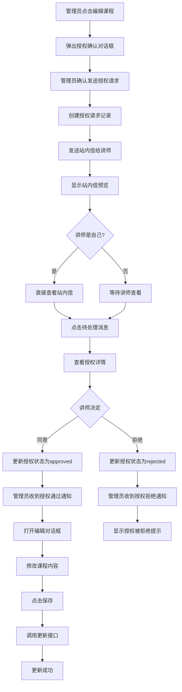
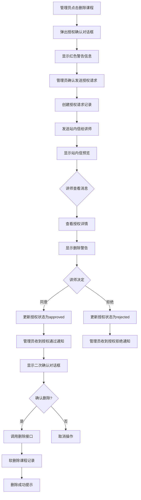
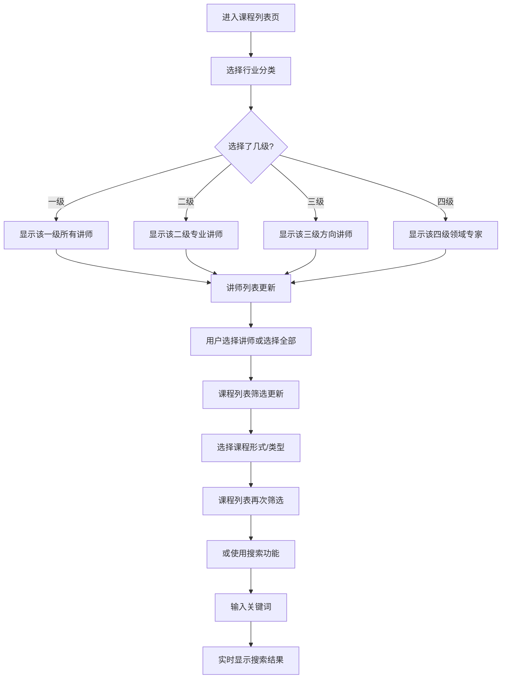

# 课程管理系统业务手册

## 目录
1. [系统概述](#系统概述)
2. [数据模型](#数据模型)
3. [页面功能](#页面功能)
4. [API接口规范](#api接口规范)
5. [数据库表结构](#数据库表结构)
6. [业务流程](#业务流程)
7. [权限与安全](#权限与安全)
8. [状态码定义](#状态码定义)

---

## 系统概述

### 1.1 系统简介
课程管理系统是商户后台的核心模块，用于管理平台上的所有课程信息。支持课程的创建、编辑、删除、查看等功能，并实现了讲师授权机制确保操作安全。

### 1.2 核心功能
- ✅ 课程列表管理（多维度筛选）
- ✅ 课程详情查看（三Tab展示）
- ✅ 课程编辑（基本信息 + 章节管理）
- ✅ 课程删除（讲师授权机制）
- ✅ 站内信通知系统
- ✅ 授权流程管理

### 1.3 业务角色
- **管理员**：可以操作所有课程，但需要讲师授权
- **讲师**：既是课程创作者，也是授权审批者
- **讲师即管理员**：自己操作自己的课程时，发送站内信给自己

---

## 数据模型

### 2.1 课程 (Course)

```typescript
interface Course {
  // 基本信息
  id: string;                        // 课程ID，唯一标识
  title: string;                     // 课程标题
  coverImage: string;                // 封面图片URL
  description: string;               // 课程简介

  // 分类信息（三维分类系统）
  industryCategoryId: string;        // 行业分类ID（外键）
  industryCategoryPath: string;      // 行业分类路径，如："计算机 > Python > Django"
  formatCategoryId: string;          // 形式分类ID（single/series）
  formatCategoryName: string;        // 形式分类名称："单课"/"套课"
  typeCategoryId: string;            // 类型分类ID（video/live）
  typeCategoryName: string;          // 类型分类名称："视频课"/"直播课"

  // 讲师信息
  instructorId: string;              // 讲师ID（外键）
  instructorName: string;            // 讲师姓名（冗余字段）
  instructorAvatar: string;          // 讲师头像URL（冗余字段）

  // 课程状态
  status: CourseStatus;              // 课程状态：presale/in_production/completed
  format: CourseFormat;              // 课程格式：single/series

  // 统计数据
  totalDuration: number;             // 总时长（分钟）
  lessonCount: number;               // 课时数（仅套课有值）
  studentCount: number;              // 学员数
  likeCount: number;                 // 点赞数
  reviewCount: number;               // 评价数
  averageRating: number;             // 平均评分（0-5）

  // 价格信息
  price: number;                     // 当前价格
  originalPrice: number;             // 原价（用于显示折扣）

  // 时间信息
  createdAt: DateTime;              // 创建时间
  publishedAt: DateTime?;           // 发布时间（可能为null）
  updatedAt: DateTime;              // 更新时间
  deletedAt: DateTime?;             // 软删除时间
}

enum CourseStatus {
  PRESALE = 'presale',              // 预售中
  IN_PRODUCTION = 'in_production',  // 制作中
  COMPLETED = 'completed'           // 已完结
}

enum CourseFormat {
  SINGLE = 'single',                // 单课
  SERIES = 'series'                 // 套课
}
```

### 2.2 章节 (Chapter)

```typescript
interface Chapter {
  id: string;                        // 章节ID
  courseId: string;                  // 课程ID（外键）
  chapterNumber: number;             // 章节序号（从1开始）
  title: string;                     // 章节标题
  sort: number;                      // 排序序号
  createdAt: DateTime;              // 创建时间
  updatedAt: DateTime;              // 更新时间
}
```

### 2.3 课时 (Lesson)

```typescript
interface Lesson {
  id: string;                        // 课时ID
  courseId: string;                  // 课程ID（外键）
  chapterId: string;                 // 章节ID（外键）
  chapterNumber: number;             // 所属章节序号
  lessonNumber: number;              // 课时序号（从1开始）
  title: string;                     // 课时标题
  outline: string;                   // 课时大纲
  duration: number;                  // 时长（分钟）
  videoUrl: string;                  // 视频URL
  isFree: boolean;                   // 是否免费试看
  materials: LessonMaterial[];       // 课时资料（图文等）
  questionCount: number;             // 该课时的问答数量
  sort: number;                      // 排序序号
  createdAt: DateTime;              // 创建时间
  updatedAt: DateTime;              // 更新时间
}

interface LessonMaterial {
  id: string;                        // 资料ID
  lessonId: string;                  // 课时ID（外键）
  type: 'image' | 'document' | 'video';  // 资料类型
  title: string;                     // 资料标题
  url: string;                       // 资料URL
  fileSize: number;                  // 文件大小（字节）
  createdAt: DateTime;              // 创建时间
}
```

### 2.4 授权请求 (AuthorizationRequest)

```typescript
interface AuthorizationRequest {
  id: string;                        // 授权请求ID
  courseId: string;                  // 课程ID
  courseTitle: string;               // 课程标题（冗余）
  operation: 'edit' | 'delete';      // 操作类型
  requesterId: string;               // 请求人ID（管理员）
  requesterName: string;             // 请求人姓名（冗余）
  instructorId: string;              // 讲师ID
  instructorName: string;            // 讲师姓名（冗余）
  status: 'pending' | 'approved' | 'rejected' | 'expired';
  reason?: string;                   // 拒绝原因（当status为rejected时）
  expiresAt: DateTime;              // 过期时间
  approvedAt: DateTime?;            // 同意时间
  rejectedAt: DateTime?;            // 拒绝时间
  createdAt: DateTime;              // 创建时间
}
```

### 2.5 站内信 (Message)

```typescript
interface Message {
  id: string;                        // 消息ID
  type: 'authorization' | 'system' | 'notification';
  title: string;                     // 消息标题
  content: string;                   // 消息内容
  senderId: string;                  // 发送人ID
  senderName: string;                // 发送人姓名
  receiverId: string;                // 接收人ID
  relatedId?: string;                // 关联对象ID（如授权请求ID）
  status: 'unread' | 'read';         // 消息状态
  createdAt: DateTime;              // 创建时间
  readAt: DateTime?;                // 阅读时间
}
```

---

## 页面功能

### 3.1 课程列表页面 (CourseListPage)

#### 功能描述
展示所有课程，支持多维度筛选和搜索，提供查看详情、编辑、删除操作。

#### 筛选区域
```
第一行：行业分类（4级级联）
  ├─ 一级分类（下拉，150px宽）
  ├─ 二级分类（下拉，150px宽）
  ├─ 三级分类（下拉，150px宽）
  └─ 四级分类（下拉，150px宽）

第二行：讲师选择
  ├─ 讲师下拉框（200px宽）
  └─ 提示文字（显示该领域讲师数量）

第三行：课程属性
  ├─ 课程形式（下拉，150px宽）
  └─ 课程类型（下拉，150px宽）

第四行：搜索和重置
  ├─ 搜索框（300px宽，支持课程名、讲师名、关键字）
  └─ 重置筛选按钮
```

#### 筛选逻辑
```typescript
// 讲师筛选
- 默认显示：请先选择行业分类
- 选择行业后：显示该领域的专业讲师
- 优先级匹配：四级 > 三级 > 二级 > 一级
- 显示数量：最多50个，超过提示"使用搜索功能"

// 搜索功能
- 支持课程名称模糊匹配
- 支持讲师名称模糊匹配
- 支持关键字搜索
- 实时显示搜索结果数量
```

#### 表格展示
```typescript
列定义：
┌──────────┬──────────┬──────┬──────┬────┬────┬────┬────┬────┬────┬────┐
│ 课程名称  │ 行业分类 │ 形式 │ 类型 │ 讲师│ 状态│ 时长│ 课时│ 学员│ 评分│ 操作│
└──────────┴──────────┴──────┴──────┴────┴────┴────┴────┴────┴────┴────┘

列宽设置：
- 课程名称: 200px（含80x60封面缩略图）
- 行业分类: 150px（支持2行显示）
- 形式/类型: 70px（带颜色标签）
- 讲师: 120px（头像+姓名）
- 状态: 70px（颜色标签）
- 时长: 80px
- 课时: 60px
- 学员: 70px
- 评分: 80px（星星+数字）
- 操作: 150px（3个图标按钮）
```

#### 操作按钮
```typescript
查看详情（visibility图标）
  └─> 打开课程详情对话框

编辑（edit图标）
  └─> 触发授权流程
       └─> 授权通过
            └─> 打开编辑对话框

删除（delete图标，红色）
  └─> 触发授权流程
       └─> 授权通过
            └─> 二次确认
                 └─> 执行删除
```

#### 交互细节
```typescript
// 1. 筛选联动
选择行业分类
  └─> 重置讲师选择
  └─> 更新讲师列表（只显示该领域讲师）
  └─> 更新提示文字（显示讲师数量）

// 2. 搜索反馈
输入关键词
  └─> 实时筛选
  └─> 显示结果数量："搜索结果: X 门课程"

// 3. 重置功能
点击重置
  └─> 清空所有筛选条件
  └─> 恢复默认状态
```

### 3.2 课程详情对话框 (CourseDetailDialog)

#### 功能描述
以Dialog形式展示课程的完整信息，支持Tab切换查看不同维度的数据。

#### 基本信息卡片
```typescript
┌────────────────────────────────────────┐
│ [课程封面 200x150]  课程标题           │
│                     分类和状态标签     │
│                     讲师头像 + 姓名     │
│                     统计数据           │
└────────────────────────────────────────┘

显示内容：
- 课程封面：200x150图片
- 课程标题：大字体加粗
- 分类标签：Chip形式（形式、类型、状态）
- 讲师信息：头像(16px) + 姓名
- 统计数据：时长、课时、学员、点赞、评价、评分
```

#### Tab结构
```typescript
Tab1: 课程简介
  ├─ 课程详细描述（多行文本）
  └─ 讲师简介
      ├─ 讲师头像(30px)
      ├─ 讲师姓名
      └─ 讲师介绍文字

Tab2: 课程目录
  ├─ 章节列表（可折叠）
  │   ├─ 第一章
  │   │   ├─ 第1节：标题
  │   │   │   ├─ 大纲说明
  │   │   │   ├─ 时长
  │   │   │   ├─ 免费标签（如果isFree=true）
  │   │   │   ├─ 问答数量
  │   │   │   └─ [查看问答]按钮
  │   │   └─ 第2节：...
  │   └─ 第二章...
  └─ 章节信息（课时数、总时长）

Tab3: 课程问答
  └─ 显示该课程的课后问答（待实现）
```

#### 章节交互
```typescript
点击章节
  └─> 展开/折叠该章节的课时列表

点击[查看问答]
  └─> 打开该课时的问答详情对话框
      └─> 显示该课时的所有课后问答
```

### 3.3 课程编辑对话框 (CourseEditDialog)

#### 功能描述
编辑课程的基本信息和章节内容，支持图文视频上传。

#### Tab结构
```typescript
Tab1: 基本信息
  ├─ 课程封面
  │   ├─ 封面预览(200x150)
  │   ├─ 封面URL输入框
  │   └─ [上传图片]按钮
  ├─ 课程标题（多行输入框）
  ├─ 课程简介（多行输入框，6行）
  └─ 课程状态和形式（下拉选择）
      ├─ 课程状态：预售/制作中/完结
      └─ 课程形式：单课/套课

Tab2: 课程章节/课时管理
  ├─ 操作按钮区
  │   ├─ [添加章节]按钮
  │   └─ [上传视频]按钮
  └─ 章节列表（卡片形式）
      ├─ 章节卡片
      │   ├─ 章节标题
      │   ├─ 课时数量
      │   ├─ [编辑]按钮
      │   ├─ [删除]按钮
      │   └─ 课时列表（可折叠）
      │       ├─ 第1节
      │       │   ├─ 播放图标
      │       │   ├─ 课时标题
      │       │   ├─ 时长
      │       │   ├─ 免费标签
      │       │   ├─ [编辑]按钮
      │       │   └─ [上传]按钮
      │       └─ 第2节...
      └─ 第二章...
```

#### 子对话框

##### 添加章节对话框
```typescript
┌─────────────────────────────────┐
│ 添加章节                   [X]  │
├─────────────────────────────────┤
│ 章节标题：                     │
│ [___________________________]   │
│                                 │
│ [取消]              [添加]     │
└─────────────────────────────────┘
```

##### 上传视频对话框
```typescript
┌─────────────────────────────────┐
│ 上传视频                   [X]  │
├─────────────────────────────────┤
│      ☁️                         │
│      ↑ 64px                     │
│   支持 MP4、AVI 等格式           │
│                                 │
│      [选择文件]                 │
│                                 │
│            [取消]                │
└─────────────────────────────────┘
```

##### 课时编辑对话框
```typescript
┌─────────────────────────────────┐
│ 编辑课时                   [X]  │
├─────────────────────────────────┤
│ 课时标题：                     │
│ [___________________________]   │
│                                 │
│ 课时大纲：                     │
│ [___________________________]   │
│ [___________________________]   │
│ [___________________________]   │
│                                 │
│ 视频URL：                      │
│ [___________________________]   │
│                                 │
│ 是否免费试看：[开关]            │
│                                 │
│ [取消]              [保存]     │
└─────────────────────────────────┘
```

#### 编辑流程
```typescript
用户修改内容
  └─> 点击[保存]按钮
       └─> 弹出确认对话框
            └─> 发送授权请求给讲师
                 └─> 站内信通知讲师
                      └─> 讲师查看并授权
                           └─> 授权通过
                                └─> 保存到数据库
                                     └─> 显示成功提示
```

### 3.4 授权流程对话框组

#### 3.4.1 授权确认对话框
```typescript
触发时机：点击[编辑]或[删除]按钮

┌─────────────────────────────────────────────┐
│ 🔒 编辑课程需要讲师授权                  [X] │
├─────────────────────────────────────────────┤
│ 您即将编辑课程"Python全栈开发实战"。      │
│                                             │
│ 系统将向该课程的讲师（张三）发送站内信   │
│ 请求授权。                                  │
│                                             │
│ ℹ️ 发送授权请求后，讲师会在"站内信"中    │
│ 收到通知。授权后即可编辑课程信息、章节    │
│ 内容等。                                   │
│                                             │
│ [取消]              [发送授权请求]         │
└─────────────────────────────────────────────┘

说明：
- 删除操作会有红色警告提示
- 信息框为蓝色背景，带边框
- [发送授权请求]按钮为橙色
```

#### 3.4.2 站内信预览对话框
```typescript
触发时机：发送授权请求后自动弹出

┌─────────────────────────────────────────────┐
│ 📧 站内信已发送                         [X] │
├─────────────────────────────────────────────┤
│ 收件人：张三                [待授权]      │
│                                             │
│ 标题：【授权请求】编辑课程：Python全栈... │
│                                             │
│ 内容：                                     │
│ 您好！                                    │
│                                             │
│ 管理员请求编辑您的课程"Python全栈开发     │
│ 实战"。                                    │
│                                             │
│ 请点击下方按钮进行授权：                  │
│ • 同意授权 - 管理员将可以编辑课程信息    │
│ • 拒绝授权 - 取消本次操作                │
│                                             │
│ 此请求将在7天后自动过期。                 │
│                                             │
│ [关闭]                  [查看站内信]      │
└─────────────────────────────────────────────┘

说明：
- 收件人显示讲师姓名
- [待授权]标签为橙色边框
- 完整展示发送的消息内容
- 可点击[查看站内信]跳转
```

#### 3.4.3 站内信列表对话框
```typescript
触发时机：点击[查看站内信]或从顶部导航进入

┌─────────────────────────────────────────────┐
│ 📧 站内信                               [X] │
├─────────────────────────────────────────────┤
│ ⏰ 【授权请求】编辑课程：Python全栈...    │
│    系统管理员 · 2分钟前    [待处理]      │
│ ──────────────────────────────────────────│
│ ✓ 【授权请求】删除课程：React18...       │
│    系统管理员 · 10分钟前   [已同意]      │
│ ──────────────────────────────────────────│
│ 📧 您的课程"Flutter移动..."已通过审核    │
│    审核团队 · 1小时前       [已读]        │
└─────────────────────────────────────────────┘

说明：
- 待处理：橙色图标 + 橙色标签
- 已同意：绿色图标 + 绿色标签
- 已拒绝：红色图标 + 红色标签
- 已读：灰色图标 + 灰色标签
- 点击消息查看详情
```

#### 3.4.4 授权详情对话框
```typescript
触发时机：点击待处理的授权请求消息

┌─────────────────────────────────────────────┐
│ 🔒 授权请求详情                         [X] │
├─────────────────────────────────────────────┤
│ 请求信息：                                 │
│ ┌───────────────────────────────────────┐ │
│ │ 请求类型：编辑课程                    │ │
│ │ 课程名称：Python全栈开发实战          │ │
│ │ 请求人：系统管理员                    │ │
│ │ 请求时间：2025-03-09 14:30            │ │
│ │ 过期时间：2025-03-16 14:30            │ │
│ └───────────────────────────────────────┘ │
│                                             │
│ 授权说明：                                 │
│ ┌───────────────────────────────────────┐ │
│ │ 授权后，管理员将可以编辑该课程的     │ │
│ │ 以下内容：                             │ │
│ │ • 课程标题、简介、封面                │ │
│ │ • 章节和课时信息                       │ │
│ │ • 图文和视频内容                       │ │
│ │ • 课程状态和价格                       │ │
│ └───────────────────────────────────────┘ │
│                                             │
│ [拒绝授权(红色)]      [同意授权(绿色)]   │
└─────────────────────────────────────────────┘

删除操作的授权说明（红色警告）：
┌───────────────────────────────────────┐
│ ⚠️ 警告：授权后，该课程将被永久删除！│
│                                         │
│ 删除内容包括：                         │
│ • 课程基本信息                         │
│ • 所有章节和课时                       │
│ • 学员学习记录                         │
│ • 课程问答数据                         │
│                                         │
│ 此操作不可恢复！                       │
└───────────────────────────────────────┘
```

#### 3.4.5 授权成功对话框
```typescript
触发时机：点击[同意授权]按钮

编辑操作授权成功：
┌─────────────────────────────────────────┐
│ ✓ 授权成功                          [X] │
├─────────────────────────────────────────┤
│ 授权已通过，现在可以编辑课程了。       │
│                                         │
│            [开始编辑]                 │
└─────────────────────────────────────────┘

删除操作授权成功：
┌─────────────────────────────────────────┐
│ ✓ 授权成功                          [X] │
├─────────────────────────────────────────┤
│ 授权已通过，课程将被删除。            │
│                                         │
│ [取消]              [确认删除(红色)]  │
└─────────────────────────────────────────┘

说明：
- 点击[开始编辑]打开编辑对话框
- 点击[确认删除]执行删除操作
- 删除成功后显示SnackBar提示
```

---

## API接口规范

### 4.1 接口基础信息

**Base URL**: `/api/courses`

**统一响应格式**:
```typescript
interface ApiResponse<T> {
  code: number;           // 状态码：200成功，400客户端错误，500服务器错误
  message: string;        // 响应消息
  data?: T;              // 响应数据
  timestamp: number;     // 时间戳
}

interface PaginationResponse<T> {
  items: T[];           // 数据列表
  total: number;         // 总数
  page: number;          // 当前页
  pageSize: number;      // 每页数量
  totalPages: number;   // 总页数
}
```

### 4.2 课程列表接口

#### 获取课程列表
```http
GET /api/courses

Query Parameters:
{
  page?: number;              // 页码，默认1
  pageSize?: number;          // 每页数量，默认10
  instructorId?: string;      // 讲师ID筛选
  industryCategoryId?: string; // 行业分类ID筛选
  formatCategoryId?: string;  // 形式分类ID筛选
  typeCategoryId?: string;    // 类型分类ID筛选
  searchKeyword?: string;     // 搜索关键词（课程名或讲师名）
  sortBy?: 'createdAt' | 'studentCount' | 'averageRating'; // 排序字段
  sortOrder?: 'asc' | 'desc'; // 排序方向
}

Response 200:
{
  "code": 200,
  "message": "success",
  "data": {
    "items": [Course],
    "total": 120,
    "page": 1,
    "pageSize": 10,
    "totalPages": 12
  },
  "timestamp": 1709980800000
}
```

#### 获取课程详情
```http
GET /api/courses/{courseId}

Path Parameters:
  courseId: string  // 课程ID

Response 200:
{
  "code": 200,
  "message": "success",
  "data": {
    "course": Course,
    "chapters": Chapter[],
    "instructor": {
      "id": string,
      "name": string,
      "avatar": string,
      "bio": string
    }
  },
  "timestamp": 1709980800000
}

Response 404:
{
  "code": 404,
  "message": "课程不存在",
  "timestamp": 1709980800000
}
```

### 4.3 课程管理接口

#### 创建课程
```http
POST /api/courses

Request Body:
{
  "title": string;              // 必填
  "coverImage": string;         // 必填
  "description": string;        // 必填
  "industryCategoryId": string; // 必填
  "formatCategoryId": string;   // 必填
  "typeCategoryId": string;     // 必填
  "instructorId": string;       // 必填
  "format": CourseFormat;       // 必填
  "price": number;              // 必填
  "originalPrice": number;      // 可选
  "status": CourseStatus;       // 默认presale
}

Response 201:
{
  "code": 201,
  "message": "课程创建成功",
  "data": {
    "courseId": string
  },
  "timestamp": 1709980800000
}

Response 400:
{
  "code": 400,
  "message": "参数错误",
  "errors": [
    {
      "field": "title",
      "message": "课程标题不能为空"
    }
  ],
  "timestamp": 1709980800000
}
```

#### 更新课程基本信息
```http
PUT /api/courses/{courseId}

Request Body:
{
  "title": string;
  "coverImage": string;
  "description": string;
  "industryCategoryId": string;
  "formatCategoryId": string;
  "typeCategoryId": string;
  "price": number;
  "originalPrice": number;
  "status": CourseStatus;
}

注意：此接口需要讲师授权！

Response 200:
{
  "code": 200,
  "message": "课程更新成功",
  "data": {
    "course": Course
  },
  "timestamp": 1709980800000
}

Response 403:
{
  "code": 403,
  "message": "需要讲师授权",
  "data": {
    "authorizationRequestId": string
  },
  "timestamp": 1709980800000
}
```

#### 删除课程
```http
DELETE /api/courses/{courseId}

注意：此接口需要讲师授权！

Response 200:
{
  "code": 200,
  "message": "课程删除成功",
  "timestamp": 1709980800000
}

Response 403:
{
  "code": 403,
  "message": "需要讲师授权",
  "data": {
    "authorizationRequestId": string
  },
  "timestamp": 1709980800000
}
```

### 4.4 章节管理接口

#### 创建章节
```http
POST /api/courses/{courseId}/chapters

Request Body:
{
  "title": string;       // 必填
  "sort": number;        // 排序，可选
}

Response 201:
{
  "code": 201,
  "message": "章节创建成功",
  "data": {
    "chapterId": string
  },
  "timestamp": 1709980800000
}
```

#### 更新章节
```http
PUT /api/courses/{courseId}/chapters/{chapterId}

Request Body:
{
  "title": string;
  "sort": number;
}

Response 200:
{
  "code": 200,
  "message": "章节更新成功",
  "timestamp": 1709980800000
}
```

#### 删除章节
```http
DELETE /api/courses/{courseId}/chapters/{chapterId}

Response 200:
{
  "code": 200,
  "message": "章节删除成功",
  "timestamp": 1709980800000
}
```

### 4.5 课时管理接口

#### 创建课时
```http
POST /api/courses/{courseId}/lessons

Request Body:
{
  "chapterId": string;      // 必填
  "title": string;          // 必填
  "outline": string;        // 可选
  "duration": number;       // 必填，分钟
  "videoUrl": string;       // 必填
  "isFree": boolean;        // 默认false
  "sort": number;           // 排序，可选
}

Response 201:
{
  "code": 201,
  "message": "课时创建成功",
  "data": {
    "lessonId": string
  },
  "timestamp": 1709980800000
}
```

#### 更新课时
```http
PUT /api/courses/{courseId}/lessons/{lessonId}

Request Body:
{
  "chapterId": string;
  "title": string;
  "outline": string;
  "duration": number;
  "videoUrl": string;
  "isFree": boolean;
  "sort": number;
}

Response 200:
{
  "code": 200,
  "message": "课时更新成功",
  "timestamp": 1709980800000
}
```

#### 删除课时
```http
DELETE /api/courses/{courseId}/lessons/{lessonId}

Response 200:
{
  "code": 200,
  "message": "课时删除成功",
  "timestamp": 1709980800000
}
```

#### 上传视频
```http
POST /api/courses/{courseId}/lessons/{lessonId}/upload-video

Content-Type: multipart/form-data

Form Data:
{
  "video": File;           // 视频文件
}

Response 200:
{
  "code": 200,
  "message": "视频上传成功",
  "data": {
    "videoUrl": string,     // 视频URL
    "duration": number,     // 视频时长（秒）
    "thumbnail": string     // 视频缩略图URL
  },
  "timestamp": 1709980800000
}

Response 413:
{
  "code": 413,
  "message": "视频文件过大，最大支持2GB",
  "timestamp": 1709980800000
}
```

#### 上传图片
```http
POST /api/courses/images

Content-Type: multipart/form-data

Form Data:
{
  "image": File;           // 图片文件
}

Response 200:
{
  "code": 200,
  "message": "图片上传成功",
  "data": {
    "url": string,          // 图片URL
    "size": number          // 文件大小
  },
  "timestamp": 1709980800000
}
```

### 4.6 授权管理接口

#### 创建授权请求
```http
POST /api/authorization-requests

Request Body:
{
  "courseId": string;      // 必填
  "operation": 'edit' | 'delete'; // 必填
}

Response 201:
{
  "code": 201,
  "message": "授权请求已发送",
  "data": {
    "authorizationRequestId": string,
    "expiresAt": string      // ISO8601格式
  },
  "timestamp": 1709980800000
}
```

#### 获取待处理的授权请求（讲师端）
```http
GET /api/authorization-requests/pending

Query Parameters:
{
  page?: number;           // 页码
  pageSize?: number;       // 每页数量
}

Response 200:
{
  "code": 200,
  "message": "success",
  "data": {
    "items": [AuthorizationRequest],
    "total": number
  },
  "timestamp": 1709980800000
}
```

#### 处理授权请求（讲师端）
```http
POST /api/authorization-requests/{authorizationRequestId}/handle

Request Body:
{
  "action": 'approve' | 'reject';
  "reason?: string;        // 拒绝原因（当action为reject时必填）
}

Response 200:
{
  "code": 200,
  "message": "授权已处理",
  "timestamp": 1709980800000
}
```

### 4.7 站内信接口

#### 获取站内信列表
```http
GET /api/messages

Query Parameters:
{
  page?: number;
  pageSize?: number;
  type?: 'authorization' | 'system' | 'notification';
  status?: 'unread' | 'read';
}

Response 200:
{
  "code": 200,
  "message": "success",
  "data": {
    "items": [Message],
    "total": number,
    "unreadCount": number
  },
  "timestamp": 1709980800000
}
```

#### 标记消息为已读
```http
PUT /api/messages/{messageId}/read

Response 200:
{
  "code": 200,
  "message": "消息已标记为已读",
  "timestamp": 1709980800000
}
```

#### 批量标记已读
```http
PUT /api/messages/read-all

Response 200:
{
  "code": 200,
  "message": "所有消息已标记为已读",
  "timestamp": 1709980800000
}
```

---

## 数据库表结构

### 5.1 课程表 (courses)

```sql
CREATE TABLE courses (
  -- 基本信息
  id VARCHAR(50) PRIMARY KEY,
  title VARCHAR(200) NOT NULL COMMENT '课程标题',
  cover_image VARCHAR(500) NOT NULL COMMENT '封面图片URL',
  description TEXT COMMENT '课程简介',

  -- 分类信息
  industry_category_id VARCHAR(50) NOT NULL COMMENT '行业分类ID',
  industry_category_path VARCHAR(500) COMMENT '行业分类路径',
  format_category_id VARCHAR(50) NOT NULL COMMENT '形式分类ID',
  type_category_id VARCHAR(50) NOT NULL COMMENT '类型分类ID',

  -- 讲师信息
  instructor_id VARCHAR(50) NOT NULL COMMENT '讲师ID',
  instructor_name VARCHAR(50) NOT NULL COMMENT '讲师姓名（冗余）',
  instructor_avatar VARCHAR(500) NOT NULL COMMENT '讲师头像（冗余）',

  -- 课程状态
  status ENUM('presale', 'in_production', 'completed') NOT NULL DEFAULT 'presale' COMMENT '课程状态',
  format ENUM('single', 'series') NOT NULL COMMENT '课程格式',

  -- 统计数据
  total_duration INT NOT NULL DEFAULT 0 COMMENT '总时长（分钟）',
  lesson_count INT NOT NULL DEFAULT 0 COMMENT '课时数',
  student_count INT NOT NULL DEFAULT 0 COMMENT '学员数',
  like_count INT NOT NULL DEFAULT 0 COMMENT '点赞数',
  review_count INT NOT NULL DEFAULT 0 COMMENT '评价数',
  average_rating DECIMAL(3,2) NOT NULL DEFAULT 0.00 COMMENT '平均评分',

  -- 价格信息
  price DECIMAL(10,2) NOT NULL COMMENT '价格',
  original_price DECIMAL(10,2) COMMENT '原价',

  -- 时间戳
  created_at DATETIME NOT NULL DEFAULT CURRENT_TIMESTAMP COMMENT '创建时间',
  updated_at DATETIME NOT NULL DEFAULT CURRENT_TIMESTAMP ON UPDATE CURRENT_TIMESTAMP COMMENT '更新时间',
  published_at DATETIME COMMENT '发布时间',
  deleted_at DATETIME COMMENT '软删除时间',

  -- 索引
  INDEX idx_instructor (instructor_id),
  INDEX idx_industry_category (industry_category_id),
  INDEX idx_status (status),
  INDEX idx_format (format),
  INDEX idx_created_at (created_at),
  INDEX idx_student_count (student_count),
  INDEX idx_average_rating (average_rating),
  INDEX idx_deleted_at (deleted_at)
) ENGINE=InnoDB DEFAULT CHARSET=utf8mb4 COLLATE=utf8mb4_unicode_ci COMMENT='课程表';
```

### 5.2 章节表 (course_chapters)

```sql
CREATE TABLE course_chapters (
  id VARCHAR(50) PRIMARY KEY,
  course_id VARCHAR(50) NOT NULL COMMENT '课程ID',
  chapter_number INT NOT NULL COMMENT '章节序号',
  title VARCHAR(200) NOT NULL COMMENT '章节标题',
  sort INT NOT NULL DEFAULT 0 COMMENT '排序序号',
  created_at DATETIME NOT NULL DEFAULT CURRENT_TIMESTAMP,
  updated_at DATETIME NOT NULL DEFAULT CURRENT_TIMESTAMP ON UPDATE CURRENT_TIMESTAMP,

  UNIQUE KEY uk_course_chapter (course_id, chapter_number),
  INDEX idx_course_id (course_id),
  INDEX idx_sort (sort),

  FOREIGN KEY (course_id) REFERENCES courses(id) ON DELETE CASCADE
) ENGINE=InnoDB DEFAULT CHARSET=utf8mb4 COLLATE=utf8mb4_unicode_ci COMMENT='课程章节表';
```

### 5.3 课时表 (course_lessons)

```sql
CREATE TABLE course_lessons (
  id VARCHAR(50) PRIMARY KEY,
  course_id VARCHAR(50) NOT NULL COMMENT '课程ID',
  chapter_id VARCHAR(50) NOT NULL COMMENT '章节ID',
  chapter_number INT NOT NULL COMMENT '所属章节序号',
  lesson_number INT NOT NULL COMMENT '课时序号',
  title VARCHAR(200) NOT NULL COMMENT '课时标题',
  outline TEXT COMMENT '课时大纲',
  duration INT NOT NULL COMMENT '时长（分钟）',
  video_url VARCHAR(500) NOT NULL COMMENT '视频URL',
  is_free BOOLEAN NOT NULL DEFAULT FALSE COMMENT '是否免费试看',
  sort INT NOT NULL DEFAULT 0 COMMENT '排序序号',
  question_count INT NOT NULL DEFAULT 0 COMMENT '问答数量',
  created_at DATETIME NOT NULL DEFAULT CURRENT_TIMESTAMP,
  updated_at DATETIME NOT NULL DEFAULT CURRENT_TIMESTAMP ON UPDATE CURRENT_TIMESTAMP,

  UNIQUE KEY uk_course_lesson (course_id, chapter_number, lesson_number),
  INDEX idx_course_id (course_id),
  INDEX idx_chapter_id (chapter_id),
  INDEX idx_sort (sort),

  FOREIGN KEY (course_id) REFERENCES courses(id) ON DELETE CASCADE,
  FOREIGN KEY (chapter_id) REFERENCES course_chapters(id) ON DELETE CASCADE
) ENGINE=InnoDB DEFAULT CHARSET=utf8mb4 COLLATE=utf8mb4_unicode_ci COMMENT='课程课时表';
```

### 5.4 课时资料表 (lesson_materials)

```sql
CREATE TABLE lesson_materials (
  id VARCHAR(50) PRIMARY KEY,
  lesson_id VARCHAR(50) NOT NULL COMMENT '课时ID',
  type ENUM('image', 'document', 'video') NOT NULL COMMENT '资料类型',
  title VARCHAR(200) NOT NULL COMMENT '资料标题',
  url VARCHAR(500) NOT NULL COMMENT '资料URL',
  file_size BIGINT NOT NULL COMMENT '文件大小（字节）',
  created_at DATETIME NOT NULL DEFAULT CURRENT_TIMESTAMP,

  INDEX idx_lesson_id (lesson_id),
  INDEX idx_type (type),

  FOREIGN KEY (lesson_id) REFERENCES course_lessons(id) ON DELETE CASCADE
) ENGINE=InnoDB DEFAULT CHARSET=utf8mb4 COLLATE=utf8mb4_unicode_ci COMMENT='课时资料表';
```

### 5.5 授权请求表 (authorization_requests)

```sql
CREATE TABLE authorization_requests (
  id VARCHAR(50) PRIMARY KEY,
  course_id VARCHAR(50) NOT NULL COMMENT '课程ID',
  course_title VARCHAR(200) NOT NULL COMMENT '课程标题（冗余）',
  operation ENUM('edit', 'delete') NOT NULL COMMENT '操作类型',
  requester_id VARCHAR(50) NOT NULL COMMENT '请求人ID',
  requester_name VARCHAR(50) NOT NULL COMMENT '请求人姓名（冗余）',
  instructor_id VARCHAR(50) NOT NULL COMMENT '讲师ID',
  instructor_name VARCHAR(50) NOT NULL COMMENT '讲师姓名（冗余）',
  status ENUM('pending', 'approved', 'rejected', 'expired') NOT NULL DEFAULT 'pending' COMMENT '状态',
  reason TEXT COMMENT '拒绝原因',
  expires_at DATETIME NOT NULL COMMENT '过期时间',
  approved_at DATETIME COMMENT '同意时间',
  rejected_at DATETIME COMMENT '拒绝时间',
  created_at DATETIME NOT NULL DEFAULT CURRENT_TIMESTAMP,
  updated_at DATETIME NOT NULL DEFAULT CURRENT_TIMESTAMP ON UPDATE CURRENT_TIMESTAMP,

  INDEX idx_course_id (course_id),
  INDEX idx_instructor_id (instructor_id),
  INDEX idx_status (status),
  INDEX idx_expires_at (expires_at),
  INDEX idx_created_at (created_at),

  FOREIGN KEY (course_id) REFERENCES courses(id) ON DELETE CASCADE
) ENGINE=InnoDB DEFAULT CHARSET=utf8mb4 COLLATE=utf8mb4_unicode_ci COMMENT='授权请求表';
```

### 5.6 站内信表 (messages)

```sql
CREATE TABLE messages (
  id VARCHAR(50) PRIMARY KEY,
  type ENUM('authorization', 'system', 'notification') NOT NULL COMMENT '消息类型',
  title VARCHAR(200) NOT NULL COMMENT '消息标题',
  content TEXT NOT NULL COMMENT '消息内容',
  sender_id VARCHAR(50) NOT NULL COMMENT '发送人ID',
  sender_name VARCHAR(50) NOT NULL COMMENT '发送人姓名（冗余）',
  receiver_id VARCHAR(50) NOT NULL COMMENT '接收人ID',
  related_id VARCHAR(50) COMMENT '关联对象ID（如授权请求ID）',
  status ENUM('unread', 'read') NOT NULL DEFAULT 'unread' COMMENT '消息状态',
  created_at DATETIME NOT NULL DEFAULT CURRENT_TIMESTAMP,
  read_at DATETIME COMMENT '阅读时间',

  INDEX idx_receiver_id (receiver_id),
  INDEX idx_type (type),
  INDEX idx_status (status),
  INDEX idx_created_at (created_at),
  INDEX idx_related_id (related_id)
) ENGINE=InnoDB DEFAULT CHARSET=utf8mb4 COLLATE=utf8mb4_unicode_ci COMMENT='站内信表';
```

---

## 业务流程

### 6.1 课程创建流程



### 6.2 课程编辑授权流程



### 6.3 课程删除授权流程



### 6.4 课程筛选流程



---

## 权限与安全

### 7.1 角色权限矩阵

| 操作 | 管理员 | 讲师 | 学员 |
|------|--------|------|------|
| 查看课程列表 | ✓ | ✓自己 | ✓ |
| 查看课程详情 | ✓ | ✓自己 | ✓ |
| 创建课程 | ✓ | ✓自己 | ✗ |
| 编辑课程 | 需授权 | ✓自己 | ✗ |
| 删除课程 | 需授权 | ✓自己 | ✗ |
| 管理章节 | 需授权 | ✓自己 | ✗ |
| 上传视频 | 需授权 | ✓自己 | ✗ |
| 处理授权请求 | ✗ | ✓自己 | ✗ |

### 7.2 授权机制

#### 自动授权场景
```typescript
// 讲师编辑自己的课程
if (currentUser.id === course.instructorId) {
  // 自动授权，无需请求
  // 站内信发送给自己，但标记为"已自动授权"
}
```

#### 授权过期处理
```typescript
// 定时任务：每小时检查一次
cron: '0 * * * *'

function checkExpiredRequests() {
  const now = new Date();
  const expiredRequests = await AuthorizationRequest.findAll({
    where: {
      status: 'pending',
      expiresAt: { [Op.lt]: now }
    }
  });

  expiredRequests.forEach(request => {
    request.status = 'expired';
    request.save();

    // 发送过期通知给讲师
    sendNotification(request.instructorId, {
      type: 'authorization_expired',
      requestId: request.id
    });
  });
}
```

### 7.3 安全措施

1. **CSRF防护**
   - 所有POST/PUT/DELETE请求需要CSRF Token
   - Token有效期：2小时

2. **SQL注入防护**
   - 使用参数化查询
   - 所有用户输入必须验证

3. **文件上传安全**
   - 文件类型白名单验证
   - 文件大小限制（视频最大2GB，图片最大10MB）
   - 病毒扫描
   - 存储到OSS，不直接存放到服务器

4. **权限验证**
   - 每个API都验证用户身份
   - 验证用户是否有权限操作该课程
   - 敏感操作需要二次确认

---

## 状态码定义

### 8.1 HTTP状态码

| 状态码 | 说明 | 使用场景 |
|--------|------|----------|
| 200 | OK | 请求成功 |
| 201 | Created | 资源创建成功 |
| 400 | Bad Request | 参数错误 |
| 401 | Unauthorized | 未登录 |
| 403 | Forbidden | 无权限/需要授权 |
| 404 | Not Found | 资源不存在 |
| 413 | Payload Too Large | 文件过大 |
| 500 | Internal Server Error | 服务器错误 |

### 8.2 业务状态码

| 代码 | 说明 |
|------|------|
| 1001 | 课程不存在 |
| 1002 | 课程名称已存在 |
| 1003 | 课程状态不允许此操作 |
| 1004 | 章节不存在 |
| 1005 | 课时不存在 |
| 1006 | 授权请求不存在 |
| 1007 | 授权请求已过期 |
| 1008 | 授权请求已处理 |
| 1009 | 讲师不匹配 |
| 1010 | 课程有学员，无法删除 |
| 1011 | 视频上传失败 |
| 1012 | 图片上传失败 |

### 8.3 错误响应示例

```typescript
// 参数错误
{
  "code": 400,
  "message": "参数错误",
  "errors": [
    {
      "field": "title",
      "message": "课程标题不能为空"
    },
    {
      "field": "price",
      "message": "价格必须大于0"
    }
  ],
  "timestamp": 1709980800000
}

// 需要授权
{
  "code": 403,
  "message": "需要讲师授权",
  "data": {
    "authorizationRequestId": "ar_1234567890",
    "instructorName": "张三",
    "reason": "编辑此课程需要讲师授权"
  },
  "timestamp": 1709980800000
}

// 业务错误
{
  "code": 400,
  "message": "课程有学员，无法删除",
  "errorCode": 1010,
  "data": {
    "studentCount": 156
  },
  "timestamp": 1709980800000
}
```

---

## 附录

### A. 完整的数据模型文件

参考文件：`lib/presentation/pages/workbench/course_list/course_model.dart`

### B. API测试用例

参考文档：`docs/course_list_api_test_cases.md`（待创建）

### C. 前端组件清单

- `CourseListPage` - 课程列表主页面
- `CourseDetailDialog` - 课程详情对话框
- `CourseEditDialog` - 课程编辑对话框
- `CourseListContent` - 内容包装组件（用于merchant_dashboard）

### D. 更新日志

**v1.0.0** (2025-03-09)
- ✅ 课程列表功能
- ✅ 多维度筛选（行业、讲师、形式、类型）
- ✅ 课程详情查看
- ✅ 课程编辑功能
- ✅ 讲师授权机制
- ✅ 站内信通知系统
- ✅ 规整的表格展示

### E. 技术栈

**前端**
- Flutter 3.19+
- Dart 3.0+
- go_router

**后端**（待实现）
- Node.js / Go / Java
- MySQL 8.0+
- Redis（缓存）
- OSS（文件存储）

---

**文档版本**: v1.0.0
**最后更新**: 2025-03-09
**维护人**: 开发团队
